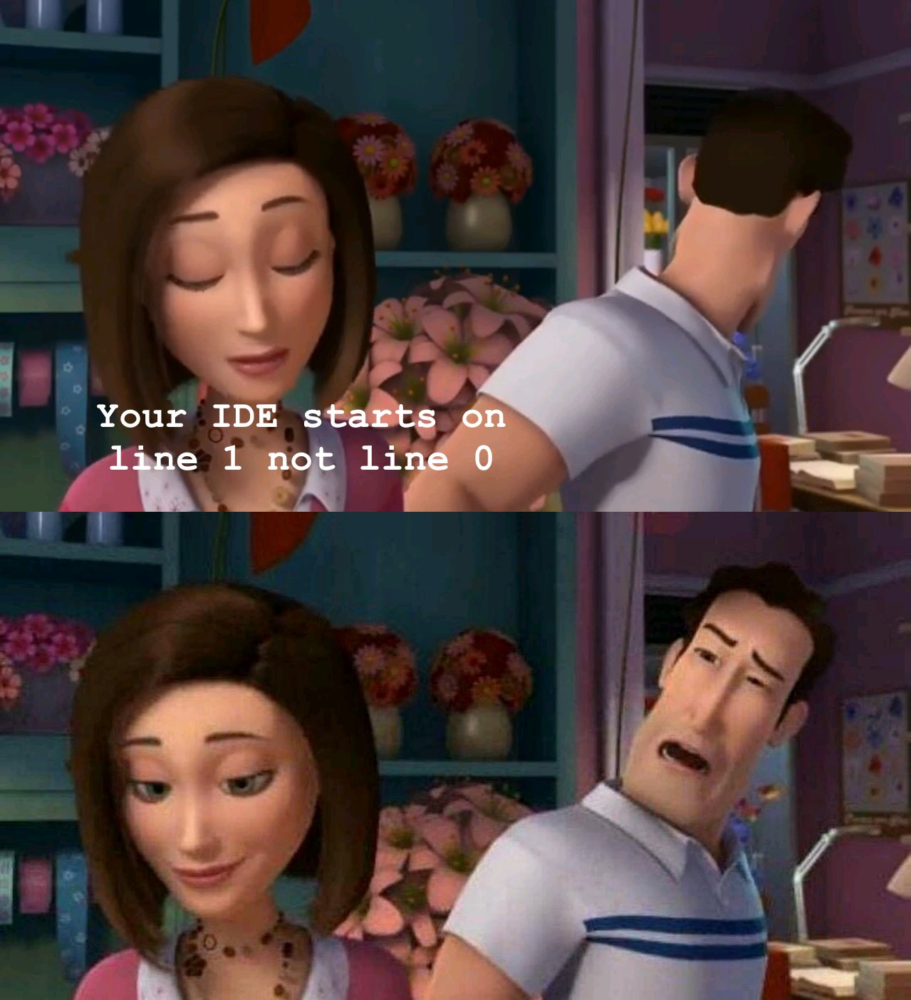

# Zero-Based Viewer

A VS Code extension that displays code with zero-based line numbering in a webview panel.

## Features

- Displays the current active editor's content with zero-based line numbering (starting from 0)
- Real-time updates when the document changes
- Uses VS Code's theme colors for consistent appearance
- Clean, minimal interface

## Usage

1. Open a file in VS Code
2. Open the Command Palette (`Ctrl+Shift+P` or `Cmd+Shift+P`)
3. Type "Show Zero-Based Viewer" and select the command
4. A new panel will open showing your code with zero-based line numbers

## Development

### Prerequisites

- Node.js
- npm

### Setup

1. Install dependencies:
   ```bash
   npm install
   ```

2. Compile the extension:
   ```bash
   npm run compile
   ```

3. Open the project in VS Code and press `F5` to run the extension in a new Extension Development Host window.

### Building

To build the extension for distribution:

```bash
npm run vscode:prepublish
```

## License

MIT 

## Meme Inspiration

This extension was inspired by the following meme, which humorously points out that most IDEs start line numbering at 1 instead of 0:

 